# 🎓 ClassLive - Classroom Management App

ClassLive is a real-time web application that helps instructors manage their classes easily. It connects instructors and students through simple dashboards, real-time chat, and easy lesson management.

---

## ✨ Key Features & Walkthrough

### 🔒 Secure 2-Step Login
Security is very important to us. Our login process keeps every user safe:
1. **Username & Password:** Both instructors and students log in using their username and password.
2. **OTP Verification:** After entering the correct password, a 6-digit code is sent to the user's phone via SMS. The user must enter this code to finish logging in.
3. **Email Setup:** When an instructor adds a new student, the system sends an email to that student. The student clicks the link in the email to set up their own username and password.

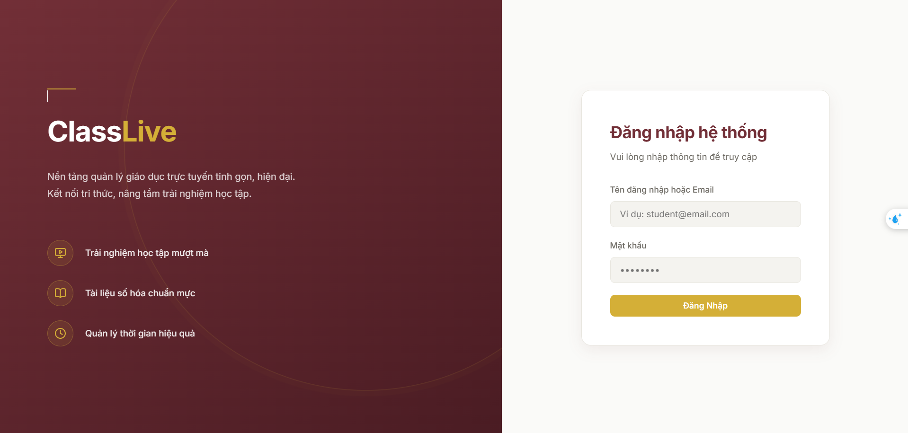

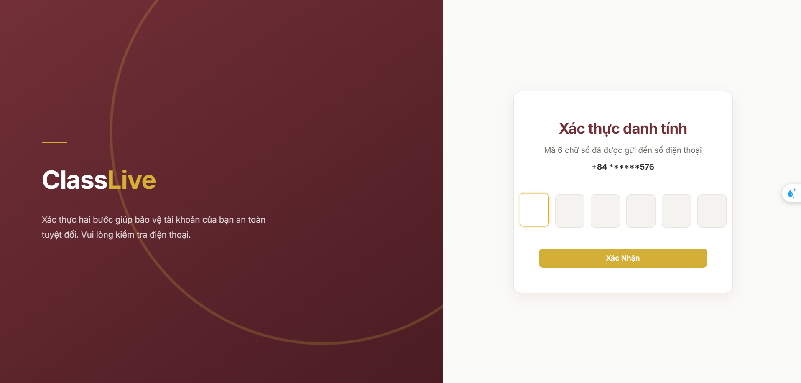

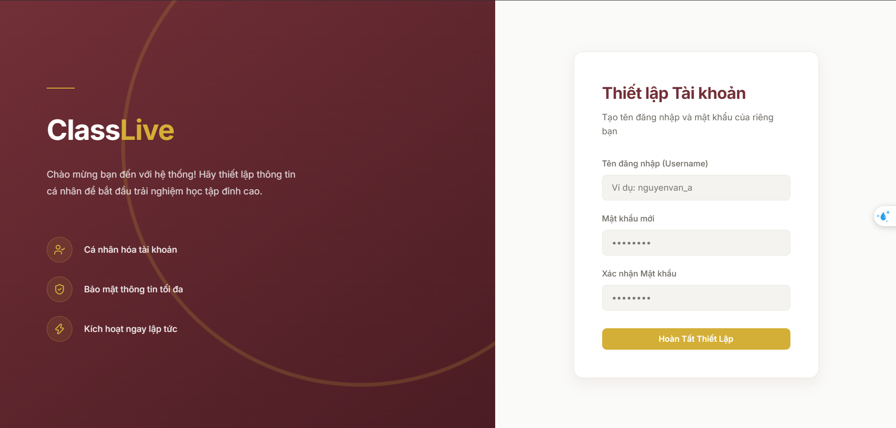

### 👨‍🏫 Instructor Dashboard
Instructors can fully control their classes using a simple dashboard.
- **Student Management:** Easily add, view, edit, and delete students. You can also search for students by name or filter them by role.
- **Lesson Management:** Create lessons and assign them to specific students. 
- **Real-time Data:** View charts that show how many students have finished their lessons.

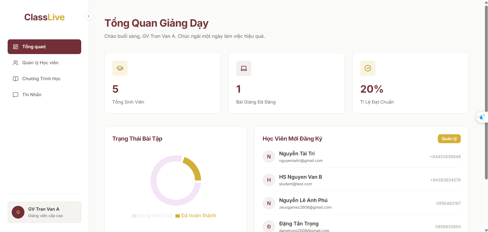

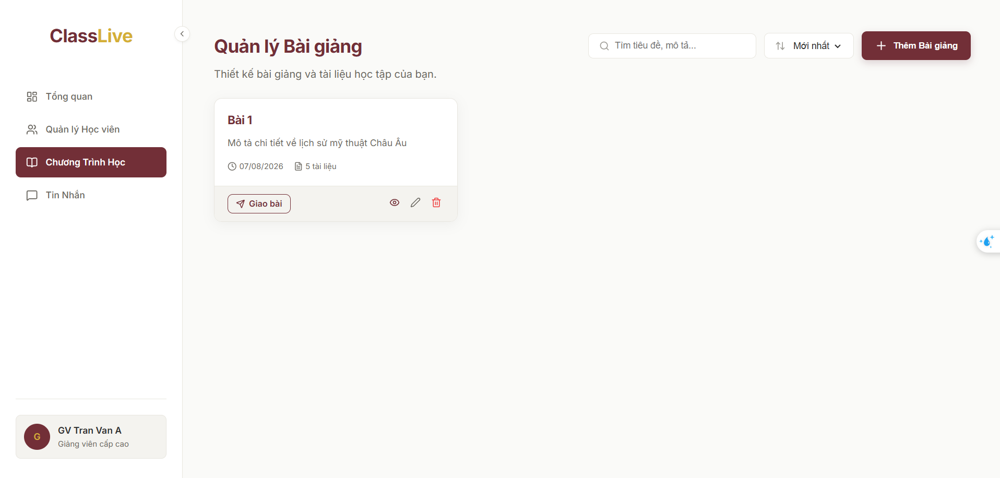

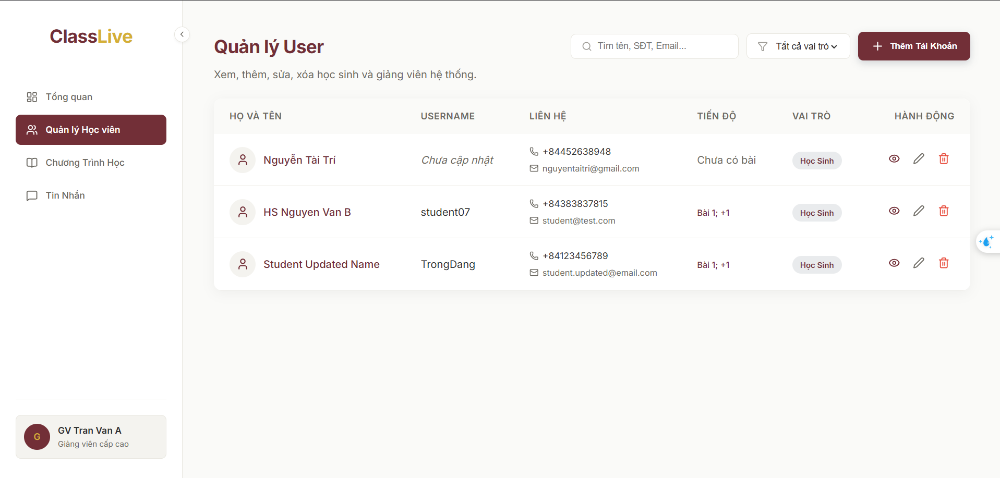

### 👩‍🎓 Student Dashboard
A clean and simple screen for students to focus on their learning.
- **My Lessons:** View all assigned lessons. You can search or sort them easily.
- **Easy Completion:** Mark a lesson as "Done" with just one click.
- **Progress Tracking:** Beautiful charts show completed and pending tasks.
- **Profile Management:** Update personal information quickly.

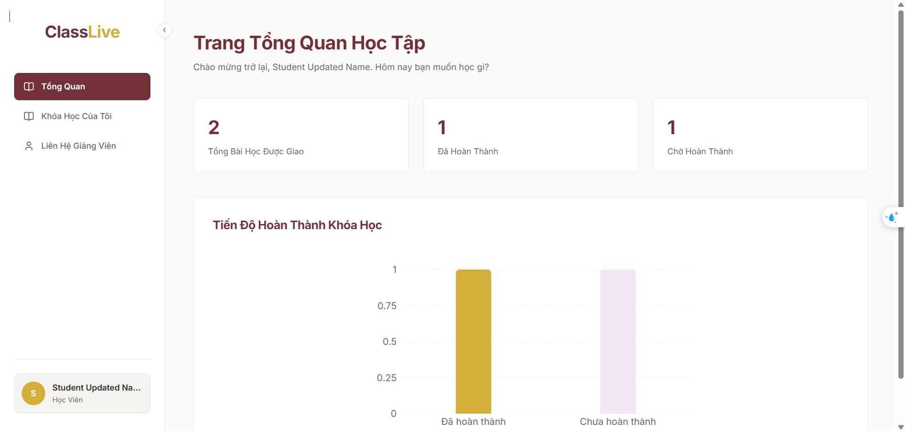

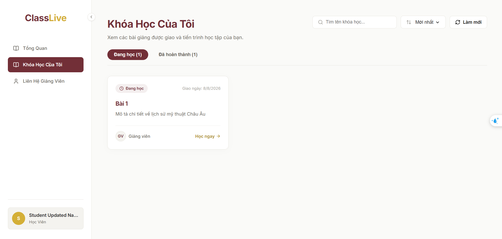

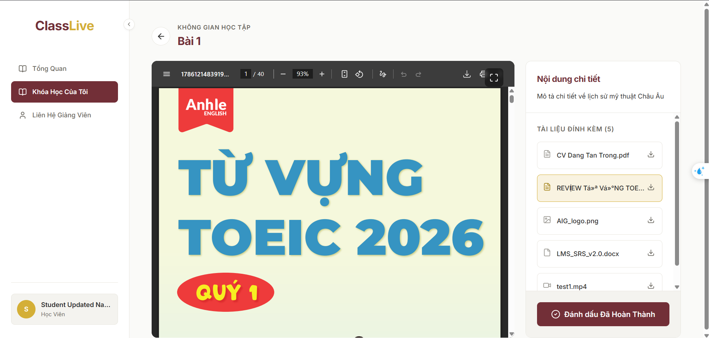

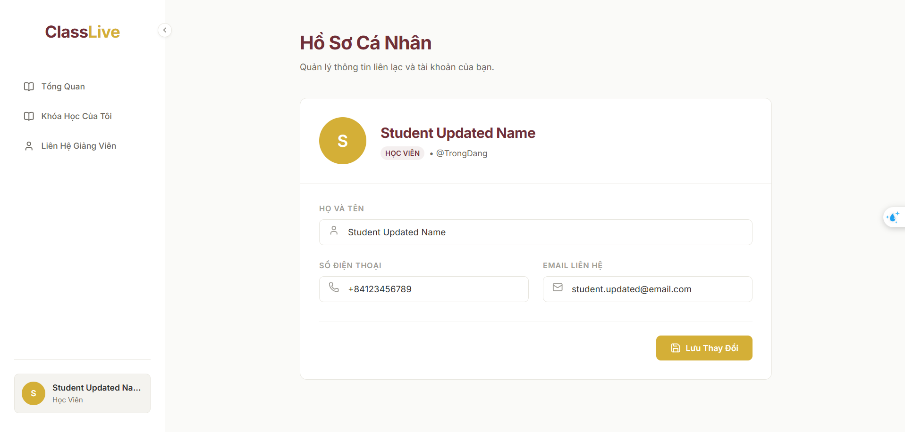

### 💬 Real-Time Live Chat
Built with Socket.io, ClassLive allows fast communication.
- Private and secure chat between a student and an instructor.
- Online status and instant message updates.

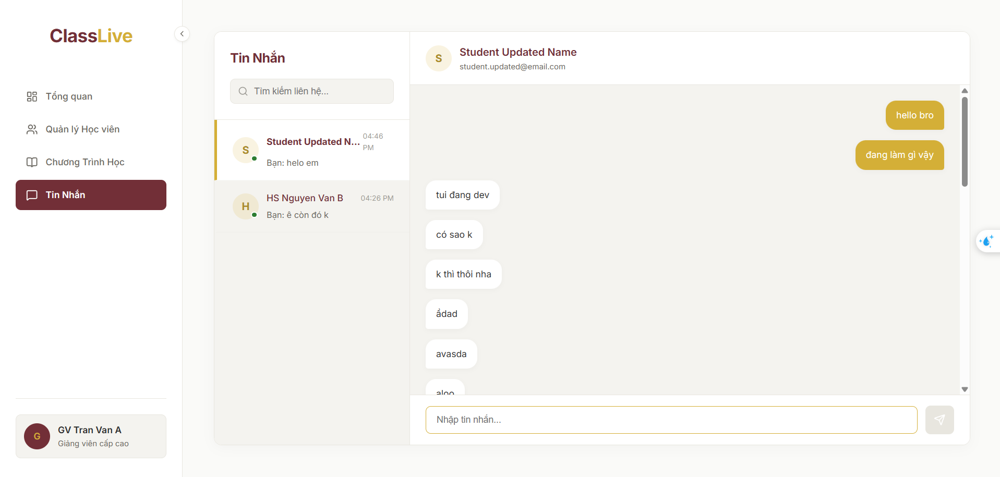

---

## 🛠️ Technology Stack

- **Frontend:** React (Vite), CSS3, Recharts, Lucide Icons
- **Backend:** Node.js, Express.js, Socket.io
- **Database:** Firebase Firestore
- **External APIs:** 
  - **SMS:** ClickSend API (for OTP)
  - **Email:** Brevo SMTP (for account setup emails)

---

## 🚀 Getting Started

Follow these steps to run the project on your local computer.

### 1. Requirements
- Node.js (version 18 or higher)
- A Firebase project with Firestore database.
- ClickSend Account (for SMS API).
- Brevo Account (for sending emails).

### 2. Backend Setup
1. Open your terminal and go to the backend folder:
   ```bash
   cd backend
   npm install
   ```
2. **Firebase Setup:** Download your Firebase Service Account JSON file. Put it in the `backend` folder and name it exactly `firebaseServiceAccount.json`.
3. **Environment Variables:** Create a `.env` file in the `backend` folder and add these lines:
   ```env
   # JWT Security Key
   JWT_SECRET=your_jwt_secret_key

   # SMS API (eSMS)
   ESMS_API_KEY=your_esms_api_key
   ESMS_SECRET_KEY=your_esms_secret_key

   # Email SMTP (Brevo)
   BREVO_SMTP_HOST=smtp-relay.brevo.com
   BREVO_SMTP_USER=your_brevo_user
   BREVO_SMTP_PASS=your_brevo_password
   BREVO_SMTP_PORT=587
   BREVO_SENDER_EMAIL=your_sender_email

   # Frontend Link
   FRONTEND_URL=http://localhost:5173
   ```
4. Start the backend server:
   ```bash
   npm run dev
   ```
   *The server will run on http://localhost:5000*

### 3. Frontend Setup
1. Open a new terminal and go to the frontend folder:
   ```bash
   cd frontend
   npm install
   ```
   *(Note: The frontend is already set to connect to http://localhost:5000/api, so you don't need a .env file here).*
2. Start the frontend application:
   ```bash
   npm run dev
   ```
   *The website will open on http://localhost:5173*
