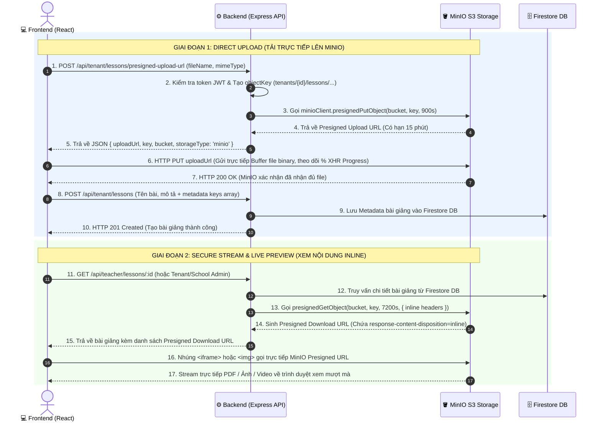

# 🏗️ MINIO S3 DIRECT-TO-S3 ARCHITECTURE - DEEP DIVE TECHNICAL DOCUMENTATION

Tài liệu này phân tích chi tiết toàn bộ kiến trúc, thiết kế hệ thống, ưu/nhược điểm, thực tế ứng dụng trong sản xuất cùng **100% đoạn code thực tế** kèm **chú thích đối chiếu trực tiếp từng dòng lệnh `[1]`, `[2]`, `[3]`** của giải pháp **Direct-to-S3 Presigned URL Upload & Stream** trong dự án **ClassLive**.

---

## 📐 1. TỔNG QUAN KIẾN TRÚC & LUỒNG DỮ LIỆU (DATA FLOW)

Trong các hệ thống học tập trực tuyến (EdTech), bài giảng và tài liệu học tập (PDF, Slide PPT, Video MP4, Ảnh bài tập) thường có dung lượng lớn (từ vài MB đến hàng GB). 

ClassLive áp dụng mô hình **Direct-to-S3 Architecture**: Trình duyệt Frontend tải file trực tiếp lên MinIO S3 Storage thông qua **Presigned PUT URL** do Backend cấp phép, thay vì trung chuyển qua Node.js Server.

### 🔄 Sơ đồ luồng Direct-to-S3 Upload & Presigned Download:



---

## ⚔️ 2. SO SÁNH CHUYÊN SÂU: DIRECT-TO-S3 VS BACKEND PROXY UPLOAD

| Tiêu chí so sánh | ❌ Mô hình cũ: Backend Proxy Upload (`multer`) | ✅ Mô hình mới: Direct-to-S3 Presigned URL |
| :--- | :--- | :--- |
| **Băng thông Backend (Bandwidth)** | **Tốn gấp 2 lần**: Băng thông BE gánh 100% lượt upload từ Client + 100% lượt đẩy sang Storage. | **Tốn 0%**: File đi thẳng từ Client đến MinIO S3. Backend chỉ tốn vài trăm bytes để trao đổi JSON presigned URL. |
| **Tải CPU / RAM của Node.js** | **Rất cao**: Đọc stream file binary, ghi RAM/Đĩa cứng gây tắc nghẽn Event Loop (Blocking) khi có nhiều request đồng thời. | **Gần như bằng 0**: Node.js giải phóng 100% tài nguyên CPU/RAM cho các nghiệp vụ logic chính. |
| **Giới hạn File Size (Payload Limit)** | Bị giới hạn bởi bộ nhớ RAM của Server và timeout của Express (thường max 50MB - 100MB). | **Không giới hạn** (hỗ trợ file hàng GB hoặc Multipart Upload song song). |
| **Trải nghiệm người dùng (UX)** | Thanh tiến trình Upload % khó chính xác, nếu BE sập mid-upload sẽ mất toàn bộ file. | Progress Bar % hiển thị thời gian thực chính xác 100% nhờ XHR Upload Progress trực tiếp. |
| **Bảo mật (Security)** | Dễ bị tấn công DoS/DDoS tràn đĩa cứng Server (`/uploads`). | An toàn tuyệt đối: Presigned URL có chữ ký mã hóa AWS Signature v4 và tự động hết hạn sau 15 phút. |

---

## 🌍 3. ỨNG DỤNG TRONG THỰC TẾ DOANH NGHIỆP (REAL-WORLD PRODUCTION PRACTICE)

1. **Coursera / Udemy**: Giảng viên tải video bài giảng 4K (5GB - 10GB) bằng Presigned PUT Multipart Upload trực tiếp lên AWS S3.
2. **Zoom / Microsoft Teams**: Stream cuộc họp recorded trực tiếp từ Object Storage với header `Content-Disposition: inline`.
3. **Enterprise SaaS**: Tách biệt hoàn toàn tầng Tính toán (**Node.js Compute**) và tầng Lưu trữ (**Object Storage MinIO/S3**).

---

## 🗂️ 4. BẢNG TỔNG HỢP CODE THỰC TẾ & GIẢI THÍCH ĐỐI CHIẾU TỪNG DÒNG LỆNH (BE ➔ FE)

---

### 🅰️ TẦNG BACKEND (SERVER NODE.JS):

#### 1. [`backend/config/minio.js`](file:///d:/HOC_TAP/Personal_Profile/Job_Applications/US_Remote_SoftwareEngineer/ClassLive/backend/config/minio.js)

```javascript
const Minio = require('minio');

let minioClient = null;
let isMinioConnected = false;

// [1] Khai báo tên 3 Buckets chuẩn cho hệ thống
const BUCKETS = {
  LESSONS: 'classlive-lessons',
  AVATARS: 'classlive-avatars',
  CHAT: 'classlive-chat'
};

async function initMinio() {
  if (minioClient) return minioClient;

  // [2] Đọc thông tin kết nối từ biến môi trường .env
  const endPoint = process.env.MINIO_ENDPOINT || '127.0.0.1';
  const port = parseInt(process.env.MINIO_PORT, 10) || 9000;
  const useSSL = process.env.MINIO_USE_SSL === 'true';
  const accessKey = process.env.MINIO_ACCESS_KEY || 'minioadmin';
  const secretKey = process.env.MINIO_SECRET_KEY || 'minioadmin';

  try {
    // [3] Khởi tạo MinIO Client Instance
    minioClient = new Minio.Client({
      endPoint,
      port,
      useSSL,
      accessKey,
      secretKey
    });

    // [4] Tự động kiểm tra và khởi tạo Buckets nếu chưa tồn tại
    for (const bucketName of Object.values(BUCKETS)) {
      const exists = await minioClient.bucketExists(bucketName).catch(() => false);
      if (!exists) {
        await minioClient.makeBucket(bucketName, 'us-east-1');
        console.log(`📦 [MinIO] Đã tự động tạo Bucket mới: '${bucketName}'`);
      }
    }

    isMinioConnected = true;
    console.log(`⚡ [MinIO] Kết nối thành công tới MinIO S3 Server tại ${endPoint}:${port}`);
    return minioClient;
  } catch (error) {
    // [5] Fallback Mode khi MinIO Server không khả dụng
    isMinioConnected = false;
    console.warn(`⚠️ [MinIO Warning]: Không thể kết nối MinIO Server (${error.message}). Kích hoạt Fallback Mode.`);
    return null;
  }
}
```

**🔍 Giải thích đối chiếu từng khối lệnh:**
- **`[1] const BUCKETS`**: Gom nhóm danh sách Bucket thành hằng số duy nhất, phân chia rõ ràng: tài liệu bài giảng (`classlive-lessons`), ảnh đại diện (`classlive-avatars`), và tệp đính kèm tin nhắn (`classlive-chat`).
- **`[2] process.env.MINIO_*`**: Lấy thông số kết nối từ `.env` để không hard-code credentials, dễ dàng chuyển đổi giữa môi trường Local Docker và Production AWS S3.
- **`[3] new Minio.Client({...})`**: Thiết lập kết nối chuẩn S3 Protocol qua cổng API `9000`.
- **`[4] minioClient.bucketExists` & `makeBucket`**: Tự động hóa việc tạo Bucket trên MinIO khi khởi động Node.js, không cần lập trình viên phải mở giao diện web MinIO Console để bấm nút tạo thủ công.
- **`[5] catch(error)` & `isMinioConnected = false`**: Cơ chế phòng thủ lỗi (Graceful Degradation). Nếu MinIO chưa được bật, Server vẫn chạy bình thường và tự chuyển sang lưu file trên ổ cứng local (`backend/uploads/`) thay vì sập API 500.

---

#### 2. [`backend/services/storageService.js`](file:///d:/HOC_TAP/Personal_Profile/Job_Applications/US_Remote_SoftwareEngineer/ClassLive/backend/services/storageService.js)

```javascript
  // [1] Hàm tạo Presigned PUT Upload URL cho phép Client đẩy file trực tiếp
  async createLessonUploadUrl(tenantId, lessonId, originalName, mimeType) {
    const sanitizedName = this._sanitizeFileName(originalName || 'file');
    const timestamp = Date.now();
    // [1.1] Phân vùng thư mục theo Tenant ID & Lesson ID
    const objectKey = `tenants/${tenantId}/lessons/${lessonId}/${timestamp}_${sanitizedName}`;
    const bucketName = BUCKETS.LESSONS;

    // [1.2] Cấp URL upload trực tiếp có hạn 900 giây (15 phút)
    const uploadUrl = await this.getPresignedPutUrl(bucketName, objectKey, 900);

    return {
      uploadUrl,
      key: objectKey,
      bucket: bucketName,
      name: sanitizedName,
      mimetype: mimeType,
      storageType: uploadUrl ? 'minio' : 'local'
    };
  }

  // [2] Hàm sinh Presigned GET Download URL kèm Inline Stream Headers
  async getPresignedUrl(bucketName, objectKey, expirySeconds = 3600, customReqParams = {}) {
    if (isMinioReady() && bucketName !== 'local') {
      try {
        const client = getMinioClient();
        const ext = (objectKey.split('?')[0].split('.').pop() || '').toLowerCase();
        
        // [2.1] Tự động suy đoán đúng MIME Type của file
        let mimeType = 'application/octet-stream';
        if (ext === 'pdf') mimeType = 'application/pdf';
        else if (['jpg', 'jpeg'].includes(ext)) mimeType = 'image/jpeg';
        else if (ext === 'png') mimeType = 'image/png';
        else if (ext === 'webp') mimeType = 'image/webp';
        else if (ext === 'mp4') mimeType = 'video/mp4';

        // [2.2] ĐIỂM CỐT LÕI KHẮC PHỤC LỖI KHUNG TRẮNG PREVIEW PDF
        const reqParams = {
          'response-content-disposition': 'inline',
          'response-content-type': mimeType,
          ...customReqParams
        };

        // [2.3] Gọi MinIO SDK tạo link ký số GET có hiệu lực
        return await client.presignedGetObject(bucketName, objectKey, expirySeconds, reqParams);
      } catch (err) {
        console.warn(`⚠️ [MinIO Presigned URL Error]: ${err.message}`);
      }
    }
    // [2.4] Fallback về đường dẫn local nếu MinIO không khả dụng
    return objectKey.startsWith('/') ? objectKey : `/${objectKey}`;
  }
```

**🔍 Giải thích đối chiếu từng khối lệnh:**
- **`[1.1] objectKey = tenants/${tenantId}/lessons/...`**: Định danh duy nhất cho từng file trên S3, ngăn chặn trùng lặp tên file và phân lập dữ liệu triệt để giữa các Tenant khác nhau.
- **`[1.2] getPresignedPutUrl(..., 900)`**: Yêu cầu MinIO cấp chữ ký mã hóa cho phép upload file qua phương thức `HTTP PUT` trong 15 phút.
- **`[2.1] mimeType suy đoán`**: Đảm bảo file `.pdf` luôn được gán đúng `application/pdf`, ảnh `.png` gán `image/png`.
- **`[2.2] 'response-content-disposition': 'inline'`**: **Khắc phục triệt để lỗi Preview PDF**. Mặc định S3 trả về `attachment` (buộc tải về máy khiến iframe bị trắng). Khi set `inline`, S3 trả header chỉ thị cho trình duyệt render trực tiếp nội dung vào trong thẻ `<iframe>` hoặc ``.
- **`[2.3] client.presignedGetObject`**: Sinh URL ký số chứa token AWS Signature v4 cho phép người dùng xem file an toàn trong 2 giờ.

---

#### 3. [`backend/controllers/tenantController.js`](file:///d:/HOC_TAP/Personal_Profile/Job_Applications/US_Remote_SoftwareEngineer/ClassLive/backend/controllers/tenantController.js)

```javascript
  // [1] Endpoint tiếp nhận yêu cầu cấp quyền upload trực tiếp từ Frontend
  getPresignedUploadUrl = catchAsync(async (req, res, next) => {
    // [1.1] Lấy Tenant ID từ Token đăng nhập của người dùng
    const tenantAdminId = req.user.id;
    const { lessonId, fileName, mimeType } = req.body;

    // [1.2] Validate dữ liệu đầu vào
    if (!fileName) {
      return res.status(400).json({ success: false, message: 'Tên file là bắt buộc' });
    }

    // [1.3] Chuyển tiếp cho Service xử lý logic
    const result = await tenantService.getPresignedUploadUrl(
      tenantAdminId,
      lessonId,
      fileName,
      mimeType || 'application/octet-stream'
    );

    // [1.4] Trả về URL ký số cho Client
    res.status(200).json({
      success: true,
      data: result
    });
  });
```

**🔍 Giải thích đối chiếu từng khối lệnh:**
- **`[1.1] req.user.id`**: Xác thực danh tính Tenant Admin từ Access Token JWT, ngăn chặn giả mạo ID.
- **`[1.2] if (!fileName)`**: Kiểm tra tính hợp lệ của request ngay tại Controller.
- **`[1.3] tenantService.getPresignedUploadUrl`**: Gọi tầng Service thực thi nghiệp vụ, tuân thủ nghiêm ngặt nguyên lý Clean Architecture.
- **`[1.4] res.status(200).json(...)`**: Trả về thông tin gồm `uploadUrl` và `key` với kích thước siêu nhẹ (`< 500 bytes`), không làm tốn tài nguyên mạng của Backend.

---

#### 4. [`backend/routes/tenantRoutes.js`](file:///d:/HOC_TAP/Personal_Profile/Job_Applications/US_Remote_SoftwareEngineer/ClassLive/backend/routes/tenantRoutes.js)

```javascript
// [1] Middleware bảo vệ toàn bộ Route: Yêu cầu đăng nhập & quyền tenant_admin
router.use(verifyToken);
router.use(restrictTo('tenant_admin'));

// [2] Khai báo API Endpoint xin URL upload trực tiếp
router.post('/lessons/presigned-upload-url', tenantController.getPresignedUploadUrl);

// [3] Khai báo API tạo bài giảng nhận mảng Metadata JSON
router.post('/lessons', upload.any(), tenantController.createLesson);
```

**🔍 Giải thích đối chiếu từng khối lệnh:**
- **`[1] router.use(verifyToken)`**: Lớp khiên bảo mật 2 tầng. Nếu chưa đăng nhập hoặc không phải `tenant_admin`, request bị từ chối ngay lập tức (401/403).
- **`[2] POST /lessons/presigned-upload-url`**: Cung cấp route RESTful chuẩn để Frontend xin phép upload trước khi gửi file lên MinIO.
- **`[3] POST /lessons`**: Nhận JSON danh sách file metadata sau khi Frontend đã hoàn tất việc upload trực tiếp lên S3.

---

#### 5. [`backend/services/tenantService.js`](file:///d:/HOC_TAP/Personal_Profile/Job_Applications/US_Remote_SoftwareEngineer/ClassLive/backend/services/tenantService.js)

```javascript
  async getLessonById(lessonId, tenantAdminId) {
    const cacheKey = `classlive:tenant:lesson_detail:${tenantAdminId}:${lessonId}`;
    return await cacheService.remember(cacheKey, 1800, async () => {
      // [1] Truy vấn thông tin bài giảng từ Firestore DB
      const lesson = await lessonRepository.findLessonById(lessonId);
      if (!lesson) {
        throw new AppError('Bài giảng không tồn tại', 404);
      }
      if (lesson.createdBy !== tenantAdminId) {
        throw new AppError('Bạn không có quyền truy cập bài giảng này', 403);
      }

      // [2] Tự động làm mới Presigned Download URL cho toàn bộ file đính kèm
      const filesWithUrls = await Promise.all(
        (lesson.files || []).map(async (file) => {
          if (file && (file.storageType === 'minio' || file.key)) {
            // [2.1] Sinh Presigned URL tươi mới có thời hạn 7200 giây (2 giờ)
            const presignedUrl = await storageService.getPresignedUrl(
              file.bucket || BUCKETS.LESSONS,
              file.key,
              7200
            );
            return {
              ...file,
              url: presignedUrl
            };
          }
          return file;
        })
      );

      // [3] Trả về Object bài giảng hoàn chỉnh kèm link xem trực tiếp
      return {
        ...lesson,
        files: filesWithUrls
      };
    });
  }
```

**🔍 Giải thích đối chiếu từng khối lệnh:**
- **`[1] lessonRepository.findLessonById`**: Lấy bài giảng từ Firestore và kiểm tra quyền sở hữu của Tenant Admin.
- **`[2] Promise.all(...)` & `storageService.getPresignedUrl`**: Quét toàn bộ mảng `lesson.files`. Với mỗi file lưu trên MinIO S3, hệ thống tự động sinh một URL có chữ ký mới với hạn 2 giờ (`7200s`).
- **`[3] return { ...lesson, files: filesWithUrls }`**: Client khi nhận được dữ liệu có thể mở xem trực tiếp bài giảng mà không lo link bị hết hạn signature.

---

#### 6. [`backend/scripts/testDirectUpload.js`](file:///d:/HOC_TAP/Personal_Profile/Job_Applications/US_Remote_SoftwareEngineer/ClassLive/backend/scripts/testDirectUpload.js)

```javascript
const axios = require('axios');
const { initMinio } = require('../config/minio');
const storageService = require('../services/storageService');

async function runDirectUploadTest() {
  await initMinio();
  
  // [1] Sinh Presigned Upload URL cho file kiểm thử
  const presignedInfo = await storageService.createLessonUploadUrl(
    'tenant-demo-hcm',
    'lesson-pdf-preview',
    'Controller_DTO_DoctorBooking.pdf',
    'application/pdf'
  );

  // [2] Giả lập Client gửi HTTP PUT đẩy 50KB Buffer PDF trực tiếp lên MinIO
  const dummyPdfBuffer = Buffer.from('%PDF-1.4 ... Dummy Content ...');
  const uploadRes = await axios.put(presignedInfo.uploadUrl, dummyPdfBuffer, {
    headers: { 'Content-Type': 'application/pdf' }
  });
  console.log('📤 Upload Status:', uploadRes.status); // 200 OK

  // [3] Xác minh Presigned Download URL có chứa header response-content-disposition=inline
  const downloadUrl = await storageService.getPresignedUrl(presignedInfo.bucket, presignedInfo.key, 300);
  console.log('✅ Presigned URL có chứa inline:', downloadUrl.includes('response-content-disposition=inline'));
}
```

**🔍 Giải thích đối chiếu từng khối lệnh:**
- **`[1] createLessonUploadUrl`**: Tạo URL thử nghiệm với key chuẩn trên bucket `classlive-lessons`.
- **`[2] axios.put(presignedInfo.uploadUrl, ...)`**: Giả lập hành vi thực tế của trình duyệt đẩy file binary trực tiếp lên cổng 9000 của MinIO và nhận status 200 OK.
- **`[3] downloadUrl.includes(...)`**: Kiểm thử tự động nhằm đảm bảo chuỗi ký số URL luôn đính kèm tham số `response-content-disposition=inline` để PDF render mượt mà trên UI.

---

### 🅰️ TẦNG FRONTEND (REACT CLIENT):

#### 7. [`frontend/src/features/tenant/TenantService.js`](file:///d:/HOC_TAP/Personal_Profile/Job_Applications/US_Remote_SoftwareEngineer/ClassLive/frontend/src/features/tenant/TenantService.js)

```javascript
  // [1] Gọi API Backend để xin Presigned Upload URL
  getPresignedUploadUrl: async ({ fileName, mimeType, lessonId }) => {
    const res = await axiosClient.post('/tenant/lessons/presigned-upload-url', {
      fileName,
      mimeType,
      lessonId
    });
    return res.data;
  },

  // [2] Upload trực tiếp file lên MinIO S3 bằng Native XMLHttpRequest
  uploadDirectToS3: async (uploadUrl, file, onProgress) => {
    return new Promise((resolve, reject) => {
      // [2.1] Khởi tạo XHR Object thuần
      const xhr = new XMLHttpRequest();
      xhr.open('PUT', uploadUrl, true);
      xhr.setRequestHeader('Content-Type', file.type || 'application/octet-stream');

      // [2.2] Lắng nghe sự kiện Upload Progress để cập nhật thanh tiến trình %
      xhr.upload.onprogress = (event) => {
        if (event.lengthComputable && onProgress) {
          const percent = Math.round((event.loaded / event.total) * 100);
          onProgress(percent);
        }
      };

      // [2.3] Xử lý khi upload hoàn tất
      xhr.onload = () => {
        if (xhr.status >= 200 && xhr.status < 300) {
          resolve(true);
        } else {
          reject(new Error(`Upload lên MinIO thất bại với mã lỗi ${xhr.status}`));
        }
      };

      // [2.4] Bắt lỗi mất kết nối mạng
      xhr.onerror = () => reject(new Error('Lỗi mạng khi upload file lên MinIO S3'));
      xhr.send(file);
    });
  },
```

**🔍 Giải thích đối chiếu từng khối lệnh:**
- **`[1] getPresignedUploadUrl`**: Dùng `axiosClient` gửi request JSON đến Backend ClassLive để nhận URL ký số.
- **`[2.1] const xhr = new XMLHttpRequest()`**: **Tại sao dùng XHR thuần mà không dùng `axiosClient`?** Vì `axiosClient` mặc định tự gắn header `Authorization: Bearer <JWT_Token>`. Nếu gửi token này lên MinIO S3, S3 sẽ báo lỗi bảo mật `SignatureDoesNotMatch`. Dùng XHR thuần giúp request sạch sẽ, chỉ chứa duy nhất `Content-Type` của file.
- **`[2.2] xhr.upload.onprogress`**: Hàm callback tính toán chính xác phần trăm dung lượng byte đã truyền tải (`loaded / total * 100`) để hiển thị thanh Progress Bar trên UI.

---

#### 8. [`frontend/src/features/tenant/TenantLessonModal.jsx`](file:///d:/HOC_TAP/Personal_Profile/Job_Applications/US_Remote_SoftwareEngineer/ClassLive/frontend/src/features/tenant/TenantLessonModal.jsx)

```javascript
      // [1] Vòng lặp upload từng file mới trực tiếp lên MinIO S3
      for (const file of newFiles) {
        setCurrentUploadingFile(file.name);
        setUploadProgresses(prev => ({ ...prev, [file.name]: 0 }));

        try {
          // [1.1] Bước 1: Xin URL ký số từ Backend
          const presignedRes = await TenantService.getPresignedUploadUrl({
            fileName: file.name,
            mimeType: file.type,
            lessonId: lesson?.id
          });

          const { uploadUrl, key, bucket, name, storageType } = presignedRes.data;

          if (uploadUrl && storageType === 'minio') {
            // [1.2] Bước 2: Đẩy file binary trực tiếp lên MinIO S3
            await TenantService.uploadDirectToS3(uploadUrl, file, (percent) => {
              setUploadProgresses(prev => ({ ...prev, [file.name]: percent }));
            });

            // [1.3] Bước 3: Thu thập Metadata file đã upload thành công
            uploadedFilesMeta.push({
              originalName: file.name,
              key: key,
              bucket: bucket,
              size: file.size,
              mimetype: file.type,
              storageType: 'minio'
            });
          }
        } catch (err) {
          toast.error(`Tải file '${file.name}' lên MinIO thất bại!`);
          setLoading(false);
          return;
        }
      }

      // [2] Gửi toàn bộ Metadata JSON về Backend để lưu vào Database
      const finalFiles = [...existingFiles, ...uploadedFilesMeta];
      const payload = {
        title: formData.title,
        description: formData.description,
        subject: formData.subject,
        grade: formData.grade,
        content: formData.content,
        files: finalFiles
      };
      await TenantService.createLesson(payload);
```

**🔍 Giải thích đối chiếu từng khối lệnh:**
- **`[1.1] & [1.2]`**: Thực hiện tải file trực tiếp theo từng tệp (Sequential/Parallel Upload), cập nhật progress bar từng file trên giao diện người dùng.
- **`[1.3] uploadedFilesMeta.push({...})`**: Chỉ giữ lại các trường thông tin gọn nhẹ (`key`, `bucket`, `size`, `mimetype`), không lưu trữ nội dung file trên máy chủ ứng dụng.
- **`[2] TenantService.createLesson(payload)`**: Gửi payload dạng JSON thuần về Backend để lưu vào Firestore DB, hoàn tất chu trình tạo bài giảng nhanh chóng mà không làm nghẽn mạng server.

---

#### 9. [`frontend/src/features/tenant/TenantLessonDetailModal.jsx`](file:///d:/HOC_TAP/Personal_Profile/Job_Applications/US_Remote_SoftwareEngineer/ClassLive/frontend/src/features/tenant/TenantLessonDetailModal.jsx)

```javascript
  // [1] Hàm nhận diện định dạng file PDF an toàn khi có Query String Presigned URL
  const isPdf = (file) => {
    if (!file) return false;
    if (file.mimetype === 'application/pdf') return true;
    
    const name = (file.originalName || file.name || '').toLowerCase();
    // [1.1] Bóc tách và loại bỏ chuỗi ?X-Amz-... của MinIO
    const cleanUrl = (file.url || '').split('?')[0].toLowerCase();
    
    return name.endsWith('.pdf') || cleanUrl.endsWith('.pdf');
  };

  // [2] Hàm nhận diện hình ảnh an toàn
  const isImage = (file) => {
    if (!file) return false;
    if (file.mimetype && file.mimetype.startsWith('image/')) return true;
    
    const name = (file.originalName || file.name || '').toLowerCase();
    const cleanUrl = (file.url || '').split('?')[0].toLowerCase();
    
    return /\.(jpg|jpeg|png|gif|webp|svg)$/i.test(name) || /\.(jpg|jpeg|png|gif|webp|svg)$/i.test(cleanUrl);
  };
```

**🔍 Giải thích đối chiếu từng khối lệnh:**
- **`[1.1] file.url.split('?')[0]`**: Vì Presigned URL có đuôi rất dài dạng `file.pdf?X-Amz-Algorithm=...`, nếu kiểm tra đơn giản bằng `file.url.endsWith('.pdf')` sẽ trả về `false`. Việc dùng `.split('?')[0]` giúp lấy chính xác phần đuôi mở rộng `.pdf` trước dấu hỏi chấm, kích hoạt đúng giao diện hiển thị tài liệu PDF.

---

#### 10. [`frontend/src/features/teacher/TeacherLessonViewer.jsx`](file:///d:/HOC_TAP/Personal_Profile/Job_Applications/US_Remote_SoftwareEngineer/ClassLive/frontend/src/features/teacher/TeacherLessonViewer.jsx)

```javascript
  const normalizeFile = (file, idx) => {
    // [1] Xử lý trường hợp dữ liệu cũ là chuỗi URL trực tiếp
    if (typeof file === 'string') {
      const cleanUrl = file.split('?')[0];
      const fileName = cleanUrl.split('/').pop() || `Tài liệu ${idx + 1}`;
      const ext = fileName.split('.').pop().toLowerCase();
      return {
        fileName,
        fileUrl: getFullFileUrl(file),
        rawUrl: file,
        ext
      };
    }
    
    // [2] Xử lý trường hợp dữ liệu mới là Object chứa Presigned S3 URL
    const name = file.originalName || file.originalname || file.fileName || file.name || (file.url ? file.url.split('?')[0].split('/').pop() : `Tài liệu ${idx + 1}`);
    const rawPath = file.url || file.filePath || file.path || '';
    const cleanPath = (rawPath || '').split('?')[0];
    const rawExt = (name.split('.').pop() || cleanPath.split('.').pop() || '').toLowerCase();
    const ext = file.mimetype === 'application/pdf' ? 'pdf' : rawExt;

    // [3] Trả về cấu trúc chuẩn đồng nhất cho Trình đọc bài giảng Giáo viên
    return {
      fileName: name,
      fileUrl: getFullFileUrl(rawPath),
      rawUrl: rawPath,
      ext
    };
  };
```

**🔍 Giải thích đối chiếu từng khối lệnh:**
- **`[1] typeof file === 'string'`**: Tương thích ngược (Backward Compatibility) với các bài giảng cũ được tạo trước khi tích hợp MinIO.
- **`[2] & [3]`**: Trích xuất chính xác tên bài, đường dẫn URL có chữ ký và định dạng file `ext = 'pdf'` để render toàn màn hình cho Giáo viên khi giảng dạy.

---

#### 11. [`frontend/src/features/tenant/tenant.css`](file:///d:/HOC_TAP/Personal_Profile/Job_Applications/US_Remote_SoftwareEngineer/ClassLive/frontend/src/features/tenant/tenant.css)

```css
/* [1] Khung hiển thị PDF & File đính kèm nhúng trực tiếp từ MinIO S3 */
.file-preview-embed {
  width: 100%;
  height: 520px;
  border: 1px solid var(--tenant-border);
  border-radius: var(--radius-sm);
  background-color: #f8f9fa;
}
```

**🔍 Giải thích đối chiếu từng khối lệnh:**
- **`height: 520px; width: 100%`**: Cố định kích thước khung iframe giúp PDF Viewer tích hợp sẵn của Chrome/Brave/Edge tự động căn chỉnh thanh trang, zoom và cuộn tài liệu mượt mà bên trong modal xem trước.

---

## 🔒 5. CƠ CHẾ BẢO MẬT & ĐỊNH HƯỚNG MỞ RỘNG (SECURITY & NEXT STEPS)

### 🔐 Bảo mật:
1. **Presigned Upload URL Expiry**: Giới hạn 15 phút.
2. **Presigned Download URL Expiry**: Giới hạn 2 giờ.
3. **Multi-Tenant Prefix Separation**: `tenants/{tenantId}/lessons/{lessonId}/{timestamp}_{fileName}`.

### 🚀 Định hướng tiếp theo:
- **BullMQ Background Worker (`mediaWorker`)**: Xử lý ngầm dọn dẹp file rác (orphan files), sinh ảnh thumbnail và nén video bài giảng.
